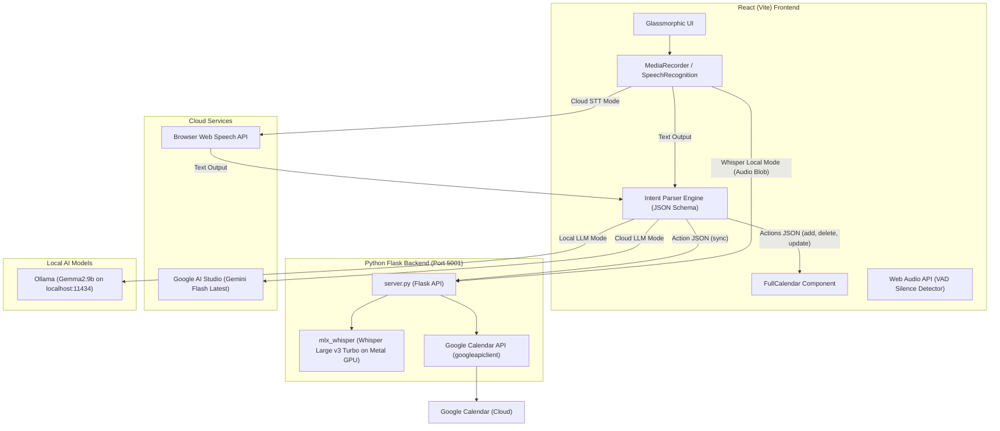

# 🎙️ Voice Calendar - AI-Powered Smart Voice Scheduling

**Voice Calendar** is a self-contained, intelligent voice-first calendar application designed for natural speech scheduling in Hebrew and English. It enables users to create, update, delete, and synchronize calendar events in real-time via natural speech commands.

The application features a flexible **hybrid architecture**, allowing users to seamlessly toggle between high-speed Cloud APIs and **100% Offline Local AI Models** powered by Apple Silicon GPU acceleration.

---

## 🌟 Key Features

- 🗣️ **Natural Speech Recognition (Hebrew & English)**: Understands natural conversational phrasing and relative time expressions (*"Tomorrow at 3 PM"*, *"Next Tuesday at 10 AM"*).
- 🎛️ **Dual Speech-to-Text (STT) Pipeline**:
  - **Web STT**: Continuous, real-time browser transcription via Web Speech API.
  - **Local Whisper**: Offline, Metal GPU-accelerated speech recognition using `mlx-community/whisper-large-v3-turbo`.
- 🤖 **Dual LLM Intent Processing Engine**:
  - **Cloud**: Powered by Google AI Studio (`gemini-flash-latest`).
  - **Local**: Powered by Ollama (`gemma2:9b`).
- 📅 **Direct Google Calendar Integration**: Auto-sync events to your primary Google Calendar via a single click or voice command (*"Update my calendar"*).
- 🎯 **Smart Calendar Auto-Navigation**: Automatically scrolls and jumps to the target date of newly created or modified events.
- 🎨 **Modern Glassmorphic UI**: Sleek dark mode interface built with responsive glassmorphism, animated mic audio waves, and instant visual feedback.

---

## 🏗️ System Architecture



---

## 🛠️ Technology Stack

### Frontend (`Voice Calendar`)
- **React 18 & Vite**: Lightning-fast SPA bundle and reactive state management.
- **Tailwind CSS**: Modern styling utility with custom glassmorphism effects, gradients, and keyframe animations.
- **FullCalendar (`@fullcalendar/react`)**: Interactive Month, Week, and Day grid calendar views.
- **Lucide React**: Clean icon set.
- **Web Audio API & MediaRecorder**: Audio stream capture equipped with client-side Voice Activity Detection (VAD) for automatic silence detection.

### Local Python Backend
- **Python 3.11+ & Flask**: Lightweight REST API server running on port `5001`.
- **Apple MLX Whisper (`mlx_whisper`)**: `whisper-large-v3-turbo` model optimized for Apple Silicon (M1–M4) Metal GPUs.
- **Google Calendar API (`googleapiclient`)**: OAuth 2.0 integration for inserting and managing events directly on Google Calendar.

---

## 📂 Directory Structure

```text
Voice Calendar/
├── src/
│   ├── App.jsx          # Main Controller (State, Voice, LLM Parser, Calendar)
│   ├── index.css        # Tailwind CSS & Glassmorphism design system
│   └── main.jsx         # React Entry Point
├── server.py            # Local Flask Server (Whisper STT & Google Calendar Sync)
├── requirements.txt     # Python backend dependencies
├── credentials.json     # Google OAuth 2.0 Client Credentials
├── token.json           # Authorized OAuth User Token
├── package.json         # Node.js dependencies
├── vite.config.js       # Vite configuration
└── README.md            # Documentation
```

---

## 🚀 Quickstart Guide

### 1. Prerequisites
Make sure you have [Node.js](https://nodejs.org/), [Python 3.11+](https://python.org/), and [FFmpeg](https://ffmpeg.org/) installed:
```bash
brew install ffmpeg
```

---

### 2. Running Ollama (For Local LLM Mode)
If you want to use the **Local LLM** mode (`gemma2:9b`) completely offline:

1. **Start Ollama Server**:
   ```bash
   ollama serve
   ```
   > Ollama will start listening locally at `http://localhost:11434`.

---

### 3. Starting the Local Python Backend
Run the backend server for local Whisper speech recognition and Google Calendar syncing:

```bash
# Create Python Virtual Environment (First time only)
python3 -m venv .venv
source .venv/bin/activate

# Install Dependencies
pip install -r requirements.txt

# Start Flask Server
python server.py
```
> The Python server will listen on `http://127.0.0.1:5001`.

---

### 4. Starting the React Frontend Application
In a separate terminal window, launch the Vite development server:
```bash
npm install
npm run dev
```
> Open your browser and navigate to `http://localhost:5173`.

---

## 💡 How It Works (End-to-End Flow)

1. **Voice Input**: Click the microphone button to start recording. In **Whisper** mode, the VAD algorithm monitors audio volume and automatically stops recording 1.8 seconds after speech ends.
2. **Speech-to-Text (STT)**: The recorded `.webm` audio blob is sent to `POST /transcribe` on the local Flask server and processed via `mlx_whisper`.
3. **Intent Parsing (LLM)**: The transcribed text is combined with the current datetime context and active event list, then sent to the LLM (Gemini or Ollama). The LLM returns a strict JSON action array (`add`, `delete`, `update`, `sync`).
4. **State & Calendar Update**: React updates the local event state, and FullCalendar automatically navigates to the event's start date.
5. **Cloud Sync**: If a `sync` action is triggered, the event list is posted to `POST /sync_calendar` and uploaded to the user's primary Google Calendar account.

---
